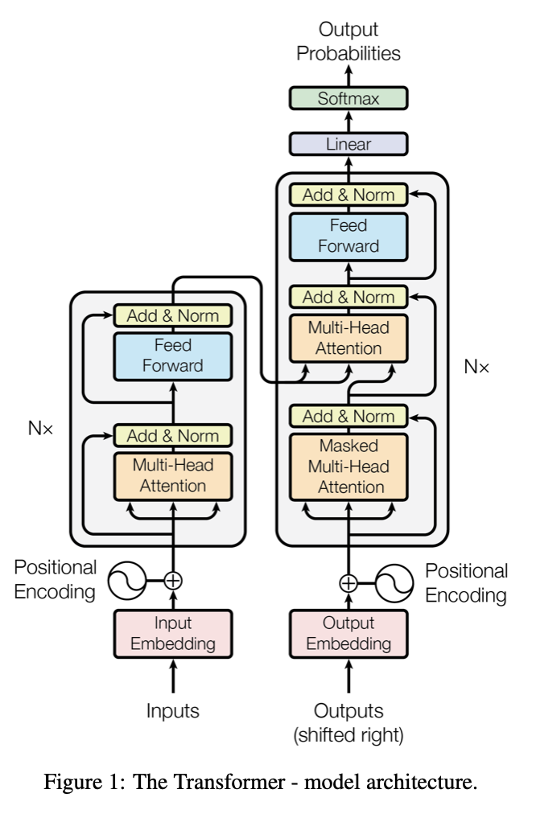

# Attention is All you Need
[link](https://arxiv.org/pdf/1706.03762.pdf)

## Overview
"Attention Is All You Need" introduces a new neural network architecture for sequence modeling, Transformers.

The Transformer uses self-attention mechanisms to compute representations of input sequences, eliminating the need for recurrent connections and convolutional operations. It achieves state-of-the-art results on several natural language processing tasks, including machine translation, language modeling, and question-answering.

The paper's key contribution is the introduction of the self-attention mechanism, which allows the model to selectively attend to different parts of the input sequence, and thereby improve its ability to model long-range dependencies. The Transformer also introduces positional encodings to provide the model with information about the position of each element in the input sequence.

## Architecture


### Encoder
 - Multi-head attention, then standard ANN as layer.
 - Residual connections and layer norm on both attention layer and ANN.

### Decoder
Similar to encoder except:
 - Masking: Mask attention for a position, i to deny it applying attention to positions > i.
 - Additional layer, between attention and standard feed-forward, an attention network onto the output of the encoding stack.

### Attention
Attention is conceptualised as perfomring a query, Q over a set of key-value, (K, V) pairs (considering, by analogy, queries on a search or database systems, or simple queries on a python dictionary). See [An Intuition for Attention](https://jaykmody.com/blog/attention-intuition/). A quick summary:
```python
pairs = {"apple": 10, "banana": 5, "chair": 2}
K, D = pairs.keys(), pairs.values()

# Standard Python-dictionary  query (true python)
Q = "apple"
pairs[Q] #  == 10

## Could also be considers as weighted sum of comparison between Q and keys:
{"apple": 10, "banana": 5, "chair": 2}, Q="apple"

(eq(Q, "apple") * pairs["apple"]) + (eq(Q, "banana") * pairs["banana"]) + (eq(Q, "chair") * pairs["chair"])
(("apple" == "apple") * 10) + (("apple" == "banana") * 5) + ("apple" == "chair") * 2)
( 1 * 10 ) + (0 * 5) + (0 * 2)  =10

## Now, instead of equality, compute weighted sum over key-query similarity.
(sim(Q, "apple") * pairs["apple"]) + (sim(Q, "banana") * pairs["banana"]) + (sim(Q, "chair") * pairs["chair"])

Q = "fruit"
(sim("fruit", "apple") * pairs["apple"]) + (sim("fruit", "banana") * pairs["banana"]) + (sim("fruit", "chair") * pairs["chair"])
0.6 * pairs["apple"] + 0.4 * pairs["banana"] + 0.0 * pairs["chair"]
8
```

Transformer attention performs the same conceptual operation, using vectors instead of words, and dot-product as for similarity (and scaled to $\[0,1 \]$ with sigmoid).

More rigorously, scaled dot-product attention:
$$
  Attention(q_i, K, V) = softmax(\frac{q_iK^T}{\sqrt{d_k}})V
$$
- Divide by $\sqrt{d_k}$ is to scale the dot product operation which can grow with dim(k) (dot product is a sum of products w.r.t. the key vectors)
Instead of performing single queries, $q_i$, use query Matrix Q:
$$$
    Attention(Q, K, V) = softmax(\frac{QK^T}{\sqrt{d_k}})V
$$$

Now Multi-head attention simply creates h linear projections of Q, K, V. The above scaled dot-product attention is performed on each projection, then concatenated together. A further linear projection is applied. The linear projections (their weight matrices), are trained.

This attention mechanism is used for:
- Connections between the encoder-decoder layers:
    - Key, values are from encoder output
    - Queries are from previous decoder output
    - Allows each position of decoder to attend to all positions in encoder
- Connections between layers of the encoder
    - Keys, values and query are all from the output of previous layer (linear projections provide a learnable source of variation between these)
    - Each layer in the encoder stack to attend to all other positions
- Connections between layers in the decoder
    - Same as with encoder layers except attention cannot be placed on subsequent inputs (masked out by $-\inf$).

Motivation for self attention:
1. Reduced complexity, per layer
2. Parralleisability
3. Improve propagation of long-range dependencies. In traditional sequence/recurrent methods use a hidden state that gets updated and propagated to each subsequent token. The dependency between far apart positions must survive significant self-updates. 

## Positional Encoding
 - Provide positional information to the attention layers (since connections attend to all inputs, no implicit position information is propagated naturally in attention models).
 - Create a position encoding (in papaer, trigonometric functions of position index)
 - Use positional encoding +  input embedding