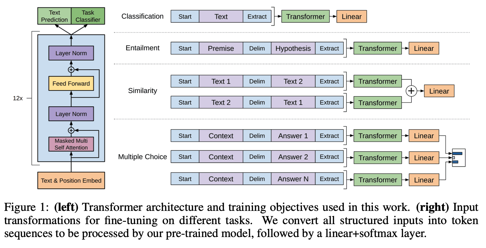

# The Evolution of GPT
- [GPT (1)](https://s3-us-west-2.amazonaws.com/openai-assets/research-covers/language-unsupervised/language_understanding_paper.pdf)
- [GPT-2](https://d4mucfpksywv.cloudfront.net/better-language-models/language-models.pdf)
- [GPT-3](https://arxiv.org/pdf/2005.14165.pdf)
- [InstructGPT](https://arxiv.org/pdf/2203.02155.pdf)

## GPT (1): Improving Language Understanding by Generative Pre-Training

- Simple transformer architecture.
- Pre-trained to perform next word prediction.
- For downstream tasks, define input sequence pattern, fine-tune with additional, final linear layer.

## GPT-2: Language Models are Unsupervised Multitask Learners
- Standard language modelling & use of transformers (like from Attention is All you Need).

- A general system should be able to handle many tasks. Condition output on input and task. I.e. instead of $p(output|input)$ (perhaps per-task), consider $p(output|input, task)$.

## GPT-3: Language Models are Few-Shot Learners
- _"While typically task-agnostic in architecture, this method _[Generative pre-training]_ still requires task-specific fine-tuning datasets of thousands or tens of thousands of examples. By contrast, humans can generally perform a new language task from only a few examples or from simple instructions – something which current NLP systems still largely struggle to do. Here we show that scaling up language models greatly improves task-agnostic, few-shot performance, sometimes even reaching competitiveness with prior state-of-the-art fine- tuning approaches."_
- In essence, large enough LLMs can perform on zero/few-shot tasks at SOTA

## InstructGPT: Training language models to follow instructions with human feedback
 - Introduces new RL technique: Reinforcement Learning from Human Feedback (RLHF).
 - Results show human preferred outputs from 1.3B parameters InstructGPT over 175B GPT-3.